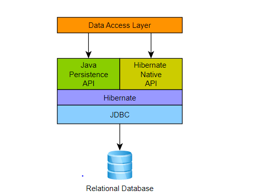

### Chapter 2: Simple Hibernate setup 

**Purpose**: setup a simple Hibernate JPA project, without using Spring Boot. 

### Introduction to JPA vs Hibernate


JPA (Java Persistence API) is a specification about how to persist data on Java. It was defined in *jakarta.persistence* package. Before java 8, it is *javax.persistence* package 

Hibernate is an ORM (Ojbect-Relation Mapping) framework, which use to save Java object into Relational database. Hibernate has it own api, which is called Hibernate Native API. It was defined in *org.hibernate* package

Also, Hibernate is a provider for JPA, which means it implements JPA api. **It highly recommends to use JPA, because we can switch provider anytime we want**

This sample code tried to config Hibernate with JPA, without Spring Boot. 

### Hibernate with JPA 
We need an object EntityManager to interact with JPA 

If we use with container-managed, like Spring Boot, the container is in charge of beginning the transaction, as well as committing or rolling it back [1]. Can get EntityManager instance like this: 
```java
@PersistenceContext
EntityManager entityManager;
```

With normal application, (don't have Spring IoC), we need to manually create EntityManager, and manage its lifecycle, which include start transaction, commit, close transaction, close entityManager, ... This chapter focus on this scenario. 

For more detail, check comment in the code for each step.

Reference:
1. [Guide to the Hibernate EntityManager](https://www.baeldung.com/hibernate-entitymanager)
2. [Diffrence between JPA API and hibernate native API](https://stackoverflow.com/questions/49475385/diffrence-between-jpa-api-and-hibernate-native-api)